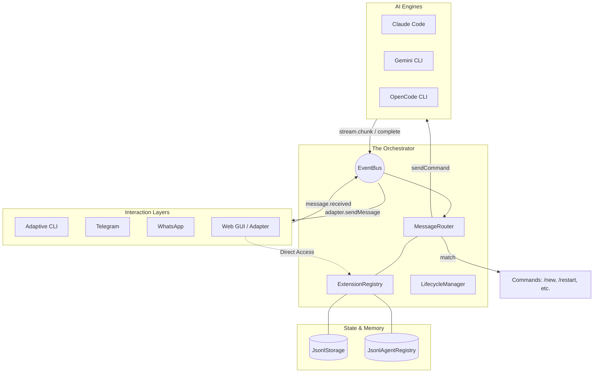

# Bark Architecture

Bark is a **thin orchestration core** for multi-turn AI agents. It follows a "Pluggable Everything" philosophy where platforms, models, and storage are entirely decoupled.

## System Overview

## Core Concepts

### 1. Message Routing Logic
The `MessageRouter` follows a tiered priority system for every incoming `message.received` event:
1.  **Command Interception**: If the payload starts with `/`, it checks `REG.getAllCommands()`. If matched (e.g., `/new`), it executes and stops.
2.  **Reply Routing**: If the message is a platform-level reply to an agent's previous message, it automatically routes back to that specific agent.
3.  **Mention Routing**: If the message starts with `@agentName`, it resolves the agent via `AREG` and routes to its assigned driver.
4.  **Fallback**: Defaults to the session's primary driver if no specific agent is targeted.

### 2. Composite Session IDs
To ensure agents have isolated memory per conversation/group, Bark uses composite session IDs:
- Format: `agentName:platformSessionId` (e.g., `chase:wa-group-12345`)
- This allows the same agent ("Chase") to maintain distinct context in different groups, preventing data contamination.

### 3. Drivers (AI Execution)
Drivers are stateless wrappers around external CLIs or APIs.
- **Claude Code**: Uses `--resume <uuid>` for native multi-turn support.
- **Gemini / OpenCode**: Leverage high-speed local CLI execution with headless flags.

## Plugin Interfaces

| Interface | Description | Key Methods |
| :--- | :--- | :--- |
| `IAdapter` | Platform Bridge | `sendMessage`, `onMessage` |
| `IDriver` | Model Wrapper | `sendCommand`, `onStream`, `onComplete` |
| `IStorage` | Session Persistence | `getSession`, `saveSession`, `deleteSession` |
| `IAgentRegistry` | Agent Definitions | `getAgent`, `saveAgent`, `listAgents` |
| `ICommand` | Interaction Hooks | `match`, `execute` |

## Data Persistence
Bark defaults to **JSONL (JSON Lines)** storage. This ensures an append-only, high-performance database that is human-readable and doesn't require a separate server process.
- **`agents.jsonl`**: Stores agent definitions (Driver, System Prompt).
- **`sessions.jsonl`**: Stores session metadata (Last used driver, etc.).
- Driver-specific history is managed locally by the respective CLI (e.g., Claude's SQLite db).

