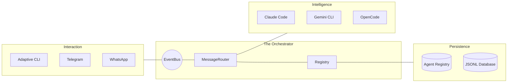

# Bark: Project Architecture

Bark is a **modular, multi-agent orchestration engine** designed for seamless AI integration across multiple platforms. It is built as a **thin core** with a plugin-first architecture.

## Monorepo Structure

The project is organized into a categorized monorepo under `packages/`:

```text
bark/
├── examples/             # Bootstrap & integration examples (e.g., full-stack.js)
├── packages/
│   ├── core/             # The "Orchestrator": EventBus, MessageRouter, Registry
│   ├── adapters/         # Platform connectors (CLI, Telegram, WhatsApp)
│   ├── drivers/          # AI engine wrappers (Claude Code, Gemini, OpenCode, Echo)
│   ├── commands/         # Built-in system commands (/new, /delete, /restart, etc.)
│   └── storages/         # Persistence layers (Memory, JSONL)
└── .data/                # Persistent JSONL flat-files (ignored by git)
```

## System Components & Flow



## Core Principles

1.  **Decoupling**: The core has zero knowledge of specific LLMs or chat platforms. Everything is an implementation of a standard interface (`IDriver`, `IAdapter`, `IStorage`).
2.  **Stateless Orchestration**: The core manages the routing and event flow, while drivers handle model-specific state (resuming sessions via UUIDs).
3.  **Composite Memory**: Agents maintain isolated conversation context per group/user using `agent:sessionId` composite keys.
4.  **Flat-File Persistence**: Default storage uses append-only JSONL files for high performance without the overhead of a database server.

## Extension Interfaces

| Interface | Role | Responsibility |
| :--- | :--- | :--- |
| `IAdapter` | Platform Bridge | Translates platform-specific events (webhooks, long-polling) to Bark events. |
| `IDriver` | AI Engine | Wraps LLM execution (local CLIs or remote APIs) and streams responses. |
| `IStorage` | Persistence | Handles session metadata and cross-agent state. |
| `IAgentRegistry` | Agent Management | Manages the definitions, personalities, and drivers for specific agents. |
| `ICommand` | Middleware | Intercepts messages to perform system-level actions (creation, deletion, etc.). |

## Quick Start
To see the entire system working together, check `examples/full-stack.js`.
